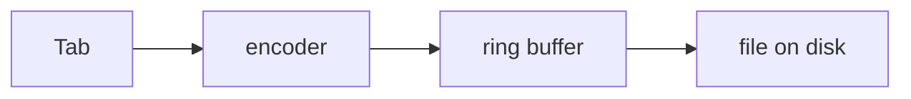

# House writing style

**Everything written in this repository is terse and formal, after Strunk and White's _Elements of Style_.**
This binds every artifact an agent produces: plans, research notes, reports, documentation, pull-request bodies, commit messages, code comments, and the text a script prints.
It is a house style, not a suggestion.

## The rules

- **No em dashes, and no en dashes.** Use a comma, a semicolon, a colon, or a full stop; write a numeric range as "5 to 6".
- **One sentence per bullet.** A bullet is a bolded lead followed by one sentence.
- **Omit needless words.** Cut throat-clearing openers, intensifiers, restatements, and the closing line that summarizes what the reader has just read.
- **Use the active voice and the positive form.** "The recorder drops a frame it cannot decode", not "a frame that cannot be decoded is not kept by the recorder".
- **Be concrete, and title things by their content.** A heading states what it holds: "Capture path", never "Some thoughts on capture".
- **Leave the personality out.** No winks, no jokes at the reader, no narration of how the work felt.
- **Verbatim material is exempt.** Quotes, API responses, UI strings, filenames, and anything a reader takes literally are reproduced exactly as they are, punctuation included.
- **Convert as you touch.** An existing document takes this style when it is edited for another reason, never as a separate sweep.

## Per surface

- **Commit messages** use conventional commits with an imperative subject under 72 characters, and a body of one-sentence bullets.
- **Plans, research, and reports** state the risk, the size, and the unknowns plainly, and never hedge a fact into a paragraph.
- **Code comments** follow this style plus the rules in [CLAUDE.md, Coding principles](../CLAUDE.md#coding-principles).
- **Script output** follows it too: a ✓ line says what happened, and an indented line under it says the detail.

## The voice of a report

**[docs/reports/README.md](reports/README.md) holds the mechanics of a report; this holds the voice.**

### Headings

**A heading names its claim or its subject, and never lists its contents.**
"Problem: the tab's audio track drifts from its video by a frame a minute" hands the reader the finding.
"One recorder, and the timing around it" makes them read the section to learn what it was about.

**A section that carries the argument names its claim; a section that is reference takes a plain noun phrase.**
Problem and Solution say what was found and what was done about it.
Architecture, Invariants and How the buffer works need nothing after the word.

**Never append a subtitle that enumerates the section.**
"Architecture: a capture worker, a ring buffer, a muxer, one writer" is a table of contents wearing a heading's clothes, and it names design decisions where a reader expects components.

**Sentence case everywhere, including after a colon**, so "Appendix C: the recorder is a single process".

**A heading may not claim something the body contradicts.**
When the body states an exposure the heading calls impossible, the heading is the thing to fix.

### Structure

**The body is the argument and the appendices are the reference.**
Problem, solution, architecture, invariants, then the mechanisms that support them.
Anything a reader consults rather than reads goes behind an appendix, including the footprint, the measurements and the evidence.

**The frequently asked questions are Appendix A**, because they are the appendix a reader reaches for first.

**Order by what bounds what, rather than by topic.**
A fact that scopes every risk beneath it opens the section, because the risks read differently once it is known.

**A section named Architecture contains a diagram of the components.**
A table naming the parts is an inventory; the reader needs to see which calls which, and where the one outward edge is.

### Sentences

**Open an answer with the answer, in bold, then support it.**
A reader who stops after the first sentence has still been told the truth.

**Every pronoun has a named antecedent on the page.**
"These have to be two checks" works under a two-item list and breaks the moment the list becomes subsections.

**Name a term before using it as one.**
A reader meeting "the coverage check" for the first time in the sentence that argues about it has been handed a proper noun and no referent.

**Show the arithmetic rather than describing it.**
Three lines of formula answer the question that two paragraphs of careful prose do not.

**Say which clock, which counter and which instrument.**
"Every minute" collapses three different periods into one word: the source's counter, the cadence a sample lands on, and how often a figure is rewritten.

### Words

**One word per concept, and prefer the word the code uses.**
A third word covering two existing ones costs a rewrite of every sentence that used either.

**A number the reader will act on belongs where they meet it.**
A ceiling somebody will decide on moves into the subtitle as soon as it is a fact.

**Say what was measured, and how.**
A figure with a method behind it survives a reader who disagrees with it; an estimate does not.

### What a report leaves out, and what it must keep

**No archaeology.**
The document does not narrate its own history, explain what a section used to say, or justify a decision by describing the mistake that preceded it.
That belongs in git and in [docs/GRILLING.md](GRILLING.md).

**No tour of defects the reader cannot act on.**
A bug that was found and fixed along the way belongs in the plan and the commit message.

**Every limitation the reader would act on differently for knowing, stated plainly.**
A claim the body contradicts is worth less than a claim that names its own limits.

## Diagrams are mermaid, never ASCII art

**A diagram is a mermaid fence.**
GitHub renders mermaid natively in a markdown file, a pull-request body and a review body, so the picture draws itself where the reader already is, and a moved box is a one-line diff.

**Draw one when the subject is a shape rather than a list.**
Architecture, the path a request takes, a state machine, and a sequence between two processes read faster as a picture; a list of facts does not.

**A fenced directory or component tree stays as it is.**
Indented text already reads as a tree and mermaid draws it worse.

**Quote any label holding punctuation the parser reads**, as in `A["GET /api (proxied)"]`.

## Line breaks depend on where the text is rendered

**A pull-request body, an issue body, and a review reply take one unwrapped line per paragraph.**
GitHub renders those surfaces with hard line breaks on, so a newline inside a paragraph becomes a real break.

**Markdown committed to the repository takes one sentence per line.**
There the newlines collapse into spaces, so this renders identically to a wrapped paragraph and reads differently in a diff: a one-word edit changes one line rather than reflowing a paragraph.

**A table row is the one thing nothing can break.**
A row is a single line whatever it holds, so keep a cell short.

**[scripts/check-one-sentence-per-line.sh](../scripts/check-one-sentence-per-line.sh) holds the rule**, wired into prek over the markdown a commit touches and over every file in `./build.sh check`.
It reports rather than rewriting, because unwrapping hand-written markdown is not a solved problem and a rewriting hook that is wrong about one paragraph in a thousand corrupts prose nobody reread.
Breaking the line is the author's edit.
