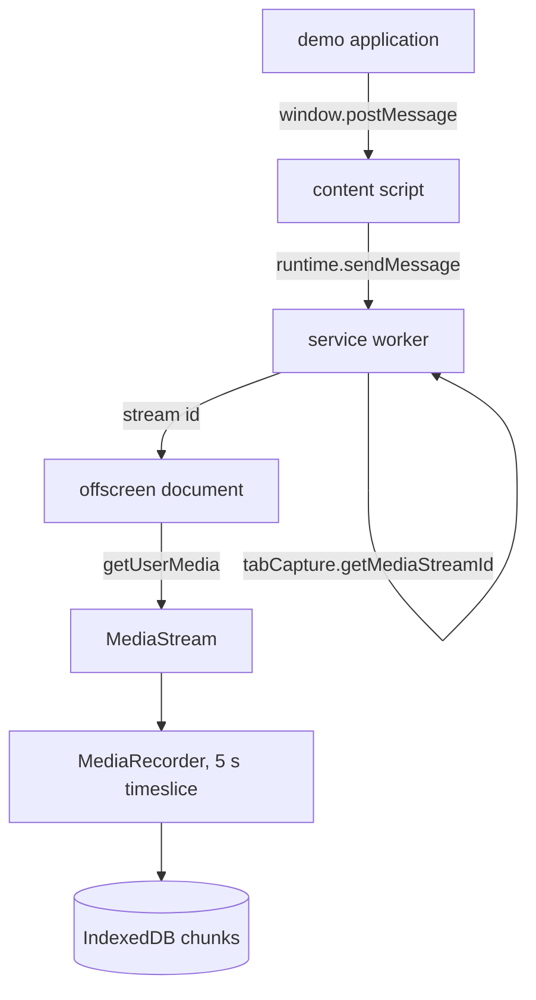

# Capture feasibility spike (2026-09-09)

The sketch in [2026-09-09-tab-recording-sidecar-sketch.md](2026-09-09-tab-recording-sidecar-sketch.md) rests on one assumption: a force-installed extension can capture a tab when a web page asks it to.
The Chrome documentation says it cannot do that without a user gesture.
This plan builds the smallest thing that settles the question on the Chrome and the policy path the fleet uses, and stops.
Nothing in phases 2 to 5 of the sketch is planned until the report of this spike is in.

## Facts already checked

- **Chrome requires the extension to be invoked before it may capture.**
  The `tabCapture` reference reads: "Capture can only be started on the currently active tab after the extension has been invoked", and compares it to `activeTab`, which "can only be called after the user invokes an extension, such as by clicking the extension's action button".
  The page says nothing about enterprise policy or force-install lifting that, and neither does the force-install help page, which says only that permissions are granted implicitly.
- **The grant outlives same-origin navigation.**
  The `activeTab` page reads: "if the user invokes the extension on https://example.com and then navigates to https://example.com/foo, the extension will continue to have access to the page.
  If the user navigates to https://chromium.org, access is revoked."
  It does not say whether a reload keeps it.
- **A stream id from the service worker can be consumed in an offscreen document**, since Chrome 116, when `consumerTabId` is left unset.
- **Off-store force-install on Windows needs an Active Directory domain join**, per Google's policy help.
  The fleet is macOS, so this does not block the spike, and it stays recorded because it decides the Windows story if one is ever wanted.
- **Playwright loads an extension only through `launchPersistentContext`** with `--disable-extensions-except` and `--load-extension`, runs it headless on the `chromium` channel, and hands a test the MV3 service worker through `context.serviceWorkers()`.
  Loading an unpacked directory is not a force-install, so Playwright proves the pipeline and not the managed path.
- **This machine** has Google Chrome 150.0.7871.101 with no Chrome policies set, Node 26.6.0 with npm 11.18.0, and ffprobe 8.1.1.
- **The answers already given** are in [docs/GRILLING.md](../GRILLING.md): one click per tab is acceptable, start and stop only, the fleet is managed macOS, the host application is a client's, the backend remuxes, recordings run under an hour, and the toolchain is TypeScript with Vite and Playwright.

## Hard rules

- `./build.sh check` passes before any piece is called done.
- No commit and no branch until Niels asks for one; the edits are reported and left in the working tree.
- Every new source file carries the MIT header from [CLAUDE.md](../../CLAUDE.md).
- The dependency budget is Vite, TypeScript and Playwright; nothing else is added during the spike.
- The spike does not build past this plan's questions.
  No upload, no provider interface, no status command, no protocol versioning.
- The spike is throwaway in shape and not in facts.
  The deliverable is the report; the code is kept only if the answer is yes.

## The questions, and what counts as an answer

Each is run on Chrome 150 on this Mac with the extension force-installed by policy, not loaded unpacked, and the result goes in the report verbatim.

**Q1: the gesture.**
With the demo application open in a tab, the application sends `START_RECORDING`:

- with no click on the extension at all, which the docs say fails, and the error text is recorded;
- after one click on the extension's action in that tab, which must succeed;
- then `STOP_RECORDING`, then start and stop again twice more, with no further click;
- then the same after the application reloads its page;
- then the same after the application moves from the landing page to the recording page, which the docs say survives.

Pass is one click per tab followed by unattended cycles, including across the landing-to-recording navigation.
The reload result is recorded either way, because a reload is what the client's application will do most.

**Q2: the file.**
After `STOP_RECORDING`, the chunks in IndexedDB are concatenated in sequence order into one file.
Pass is that ffprobe reads it with a sane duration and Chrome plays it.
The same is done for a recording whose offscreen document was killed midway, and the report says how many seconds after the last committed chunk are lost and whether the truncated file plays.
Seekability is not required, since the backend remuxes.

**Q3: audio.**
The same recording is made with `audio: true` and with `audio: false`.
The report says whether the tab goes silent while captured, whether routing the captured track through an `AudioContext` in the offscreen document restores it, and whether the file carries an audio track ffprobe can see.
This answers GRILLING 1a for audio.

**Q4: the managed path.**
The report records exactly how the extension was force-installed and configured on macOS: the plist keys, whether user-level `defaults` were honoured or a device-level managed preferences file was needed, and whether a plain-HTTP update URL on localhost was accepted for the `.crx`.
This is the part of the sketch's "must be proven against the exact Chrome release and enterprise policy configuration" that a laptop can prove.

## The work, in order

**Step 1: toolchain.**
`package.json`, a Vite config that emits the extension and the demo application into `dist/`, and the three functions in `build.sh` filled in: `build` runs Vite, `test` runs Playwright, `fmt` runs the TypeScript formatter Vite already brings, and `check` gains `tsc --noEmit`.
Size small.
Risk: Vite is built for one page, and a Manifest V3 extension has four entries, one of which, the content script, may not be an ES module and so may not import anything.
The content script stays dependency free and the other three are Rollup inputs.
Whether that builds cleanly is part of the spike: if it does not, the bundler becomes esbuild with one script per entry, and the report says which was used and why.
No Vite plugin is added either way.

**Step 2: the demo application.**
Two pages on one origin.
A landing page with one button that goes to the recording page.
The recording page has a canvas that can be drawn on with the mouse, a YouTube embed that autoplays, and a Done button back to the landing page.
Entering the recording page sends `START_RECORDING` and Done sends `STOP_RECORDING`; both pages show the last reply from the extension.
Size small.
Risk: none.
It stands in for the client's application and is the host every later phase tests against.

**Step 3: the extension, at its minimum.**

The content script forwards the two commands and their replies between the page and the service worker.
The service worker checks the origin against the managed configuration, checks the sender tab, asks for a stream id, and creates the offscreen document.
The offscreen document opens the stream, runs `MediaRecorder` with a five second timeslice, and writes each chunk to IndexedDB with the recording id, a sequence number and the MIME type.
`STOP_RECORDING` stops the recorder, waits for the last chunk, and replies.
A hidden "assemble" command in the offscreen document concatenates a recording into one Blob and downloads it, for Q2 only.
Size medium.
Risk: this is where Q1 fails if it fails.
The stream and the recorder are one object each; the sketch's separation of capture and recording lifetimes is not built here.

**Step 4: the managed install on this Mac.**
Pack the built extension into a `.crx` with a key kept out of git, serve it and an update manifest from a local static server, and set `ExtensionInstallForcelist` and the extension's managed configuration through Chrome policy on this Mac.
Size small.
Risk: the two unknowns in Q4.
If user-level policy is not honoured, a device-level managed preferences file is written and that is recorded as the deployment requirement.

**Step 5: the automated test.**
One Playwright test that launches Chromium with the unpacked extension, opens the demo application, drives landing to recording to Done, and asserts a chunk count and a decodable file.
Size small.
Risk: Playwright cannot click the toolbar, so the test cannot perform the gesture Q1 needs on its own.
The invocation is tried these ways, in order, and the first that Chrome accepts is what the test uses:

- a `commands` keyboard shortcut sent through Playwright's keyboard, which reaches the renderer over the DevTools protocol and may never reach the browser's accelerator table;
- the same shortcut sent as a real keystroke through macOS System Events with `osascript`, which needs a headed Chrome and Accessibility permission for the terminal;
- a System Events click on the extension's toolbar button, found through the accessibility tree, which is the most brittle and the most faithful.

If none of the three works, the test covers everything downstream of the grant, the grant is exercised by hand in step 6, and the report says so.

**Step 6: the run and the report.**
Q1 to Q4 run by hand on Chrome 150 with the force-installed build, every error string copied, and the report written to `docs/reports/2026-09-09-HHMM-capture-feasibility-spike.md` with its artifact page.
Size small.
Risk: none; this is the deliverable.

## What the answer decides

- **Q1 passes.**
  GRILLING 2a is answered, the sketch's phase 2 becomes the next plan, and the spike code stays as its starting point.
- **Q1 fails with one click.**
  GRILLING 2b is answered with the failure, the sketch stays as an abandoned plan, and the next plan compares a DevTools-protocol screencast of a controlled Chrome against a native capture of the Chrome window.
  Neither is planned here.

## Out of scope

- Upload, the provider interface, retries, backoff and finalization.
- Recovery beyond the concatenation in Q2.
- `GET_RECORDING_STATUS`, protocol versioning, request idempotency.
- The persistent-capture model, which was ruled out with the rolling buffer.
- Windows, ChromeOS, the Chrome Web Store, and any fleet other than managed macOS.
- Bitrate, resolution and codec tuning; the defaults in the sketch are used as they are.
- Security hardening beyond the origin allowlist.
