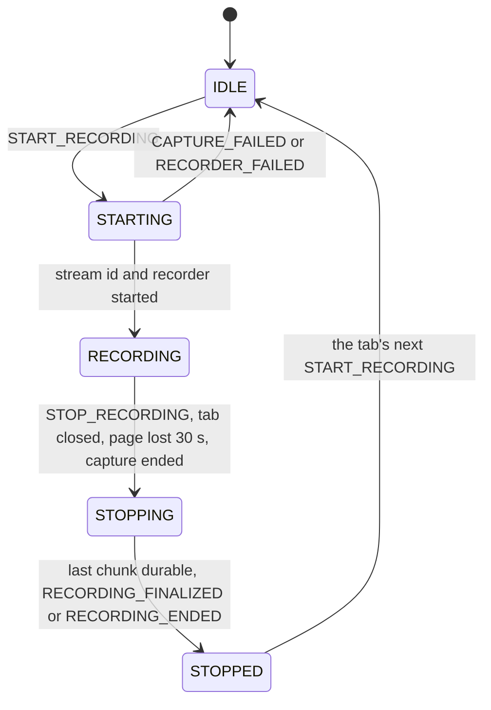

# Application contract (2026-09-10)

Phase 2 of [the sketch](2026-09-09-tab-recording-sidecar-sketch.md): the messages the client's application is written against, the state machine behind them, and the rules for duplicates, reloads and a page that goes away.
It inherits the spike's code and replaces the demo's two ad hoc messages with a versioned contract, written down in `docs/PROTOCOL.md` before the code changes.
Nothing here uploads anything; the spool stays IndexedDB and the console page.

**Reframed on 2026-09-10, before any of it was built: the next goal is a demo that sells the concept to the client, not a contract set in stone.**
The contract below is the working shape the demo speaks, and it may change once the client is in the conversation; manual or semi-automated demo setup is acceptable where a deployment would automate it.
The order of work is to be re-argued against that goal before this plan is frozen, and the decisions below stand until then.

## Facts already checked

- **Capture is granted per tab, once**, by a press of the manifest's `commands` shortcut or a click on the action, and the grant survives a reload of the page; [the gesture ladder report](../reports/2026-09-10-0005-gesture-ladder.md) measured it.
  In development Chrome is launched with `--allowlisted-extension-id` and no gesture is needed; in deployment the client's Jamf-managed Chrome gets no flag.
- **A recording outlives its page.** The spike showed a reloaded page finding its recording still running and stopping it; the recording belongs to the tab in the service worker's session storage, keyed by tab id.
- **The probe is refused while a stream is live**, with "Cannot capture a tab with an active stream.", which is not the grant refusal; the contract has to tell the two apart.
- **A service worker can be stopped at any time**, so a timeout it must honour cannot be a `setTimeout`; `chrome.alarms` fires it, and its minimum delay is 30 seconds.
- **A content script's `runtime.connect` port disconnects when its page navigates, reloads or closes**, which is how the service worker learns the page is gone without polling.
- **Force-install grants host permissions silently**, so an extension declaring `<all_urls>` and the `scripting` permission can register its content script at startup for exactly the origins in managed configuration, and inject nothing anywhere else.
- **The answers given on 2026-09-10**, recorded below as decisions: the extension is the source of truth for a recording's identity; a duplicate start returns the established result; origins come from managed configuration; a lost page stops the recording after a timeout from managed configuration, 30 seconds by default; `GET_RECORDING_STATUS` ships now; `RECORDING_FINALIZED` is defined now and emitted at stop; every message carries a protocol version; `PROBE_CAPTURE` stays.

## Hard rules

- `./build.sh check` and `./build.sh test` pass before any piece is called done, and the test runs both with the flag and, on a Mac with Accessibility, with the keystroke.
- No commit and no branch until Niels asks; the edits are reported and left in the working tree.
- The dependency budget stays TypeScript, Vite and Playwright, plus type-only packages.
- Every message that crosses the page boundary is validated in the service worker before it is acted on, because the page is the trust boundary.
- The demo application uses only the contract, so it is a fair example for the client.
- No upload, no provider interface, no bounded-storage policy; those are phases 3 and 4.

## The contract

**Every message carries `protocolVersion: 1` and a `requestId`, and a reply carries the request's id.**
A version the extension does not speak is answered with `RECORDING_ERROR`, code `PROTOCOL_MISMATCH`, naming both versions.

| Request | Reply | Notes |
| ------- | ----- | ----- |
| `PING` | `PONG` with `extensionVersion`, `extensionId`, `protocolVersion` | The page's way to find the extension |
| `PROBE_CAPTURE` | `CAPTURE_PROBED` with `granted` and `reason` | `reason` is one of `granted`, `not-invoked`, `stream-active`, `origin-not-allowed`; the page shows "press Cmd+Shift+Y once" on `not-invoked` |
| `GET_RECORDING_STATUS` | `RECORDING_STATUS` with `state`, and when one exists `recordingKey`, `recordingId`, `startedAt`, `chunks`, `bytes`, `mimeType` | The extension is the source of truth; a page asks this on load |
| `START_RECORDING` with `recordingKey`, `metadata` | `RECORDING_STARTED` with `recordingId`, `mimeType`, `video`, `audio`, `established` | Same key while live: the same reply with `established: true`; a different key while live: `RECORDING_ERROR` `ALREADY_RECORDING` naming the live key |
| `STOP_RECORDING` with `recordingKey` | `RECORDING_STOPPED` with `chunks`, `bytes`, `established` | A key already stopped and still known: the same reply with `established: true`; a key never seen: `NOT_RECORDING` |

**Two messages are unsolicited, posted to the page by the content script**, and lost without consequence if no page is there, since `GET_RECORDING_STATUS` carries the same facts:

- `RECORDING_FINALIZED` with `recordingKey`, `recordingId`, `chunks`, `bytes`, once the last chunk is durable in IndexedDB after a stop.
  Phase 4 moves its meaning to the remote and the shape does not change.
- `RECORDING_ENDED` with `recordingKey`, `recordingId`, `reason`, when the extension stopped a recording on its own: `tab-closed`, `page-lost`, `capture-ended`, `recorder-failed`.

**Capture options are not in the contract.**
They come from managed configuration, and in development from overrides the console page writes to `chrome.storage.local`; the demo's audio box and timeslice field move there.

One state per tab, kept in `chrome.storage.session`, with the last stopped recording remembered so a repeated stop can answer `established: true`.

## The work, in order

**Step 1: the contract document.**
`docs/PROTOCOL.md`, maintained, holding the table above with every field typed, the state diagram, the duplicate rules, the timeout, the two unsolicited messages, and what a page must do on load.
Size small.
Risk: none; it is the deliverable the client reads, and the rest of this plan implements it.

**Step 2: the types and the validator.**
`src/shared/protocol.ts` rewritten to the contract, and `src/extension/validation.ts`, a hand-written check that a message from the page has the shape the types claim, since a type is not a guard at runtime.
Size small.
Risk: none.

**Step 3: presence and the timeout.**
The content script opens a `runtime.connect` port on load; the service worker records the tab as present on connect and gone on disconnect, and on disconnect while recording sets a `chrome.alarms` alarm for `lostPageTimeoutSeconds` from managed configuration, default and minimum 30.
A new port from the same tab clears the alarm; the alarm firing stops the recording with `RECORDING_ENDED` `page-lost`; `tabs.onRemoved` stops it at once with `tab-closed`.
Size medium.
Risk: the alarm's 30 second floor makes a shorter timeout impossible, which the document says; and a service worker restart between disconnect and alarm must find the recording in session storage, which the spike's design already provides.

**Step 4: the state machine and idempotency.**
The service worker's start and stop rewritten around the per-tab state, with an in-flight promise so a duplicate start during `STARTING` waits for the first and returns its result, and the last stopped recording kept so a duplicate stop answers `established: true`.
`GET_RECORDING_STATUS` reads the same record and asks the offscreen document for live chunk and byte counts.
Size medium.
Risk: the offscreen document is the only holder of live counts; if it is gone, status says so rather than guessing.

**Step 5: origins from managed configuration.**
The manifest gains `scripting` and `<all_urls>`; at startup and on `storage.onChanged` for the managed area the service worker registers the content script for `allowedOrigins`, and for the localhost defaults when the managed area is empty.
The origin check before every request stays.
Size small.
Risk: `registerContentScripts` needs the matches as patterns, and an origin with a port is written as `http://localhost:5173/*`; the document shows the form.

**Step 6: finalized and ended, end to end.**
The offscreen document reports when the last write after a stop has settled; the service worker emits `RECORDING_FINALIZED` to the tab's port, or `RECORDING_ENDED` when it stopped the recording itself.
Size small.
Risk: none.

**Step 7: the demo on the contract.**
The landing page asks `PROBE_CAPTURE` and shows the shortcut hint only on `not-invoked`; the recording page asks `GET_RECORDING_STATUS` on load and either joins the live recording or starts one; session storage goes; both pages show the unsolicited messages as they arrive.
The console page gains the development overrides for audio and timeslice.
Size small.
Risk: none.

**Step 8: the tests.**
`tests/contract.spec.ts` beside the spike test: a duplicate start with the same key, with a different key, a duplicate stop, status before, during and after, a version mismatch, an origin not allowed, the reload joining its recording, the tab closing mid-recording, and the page-lost timeout with the override set to 30 seconds.
Size medium.
Risk: the timeout case waits 30 seconds and the whole file should stay under three minutes; one recording serves several assertions.

**Step 9: the report.**
What each rule did when exercised, the timing of finalized after stop, and anything the contract had to change once code met it.

## Decisions taken before the plan

- **The extension is the source of truth for identity**, over the application or a shared rule.
  A reload cannot lose a key it never held, and cannot invent a second recording; it costs one message on every page load.
- **A duplicate start returns the established result**, over an error or last-writer-wins.
  Retries are free and a retry can never cut a recording in two; it costs holding the last stopped record per tab.
- **Origins come from managed configuration and the content script is registered for exactly those**, over a compiled-in origin or `externally_connectable`.
  One deployment setting controls it and nothing is injected elsewhere; it costs `<all_urls>` in the manifest, which force-install grants silently.
- **A lost page stops the recording after 30 seconds by default**, over recording until the tab closes.
  Bounded, and a slow reload inside the window loses nothing; it costs the tail of a recording whose page stalls longer than the window.
- **`GET_RECORDING_STATUS` ships now**, with what the spool knows; the queue fields join it in phase 3.
- **`RECORDING_FINALIZED` is defined now and means durable locally**; phase 4 changes what durable means and not the message.
- **A version field on every message**, over a handshake; stateless, and every log line says what it spoke.
- **`PROBE_CAPTURE` stays**, so the page can show the shortcut hint only when it is needed.

## Out of scope

- Upload, providers, retries, remote finalization.
- A bounded spool, quota handling, recovery after a browser crash beyond what the spike already keeps.
- Cross-origin navigation, which the documentation says revokes the grant and which the fleet's application does not do.
- The rolling buffer, the Web Store, Windows and ChromeOS.
- Any change to capture defaults.
