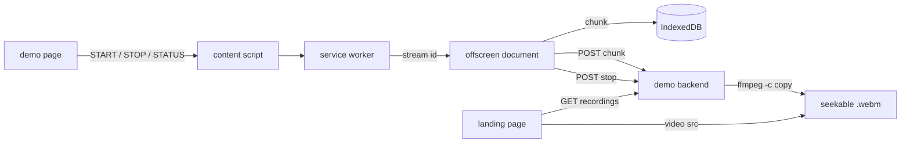

# The demo (2026-09-10)

The recorder in a state that sells the concept to the client, argued on 2026-09-10 and superseding the order of [the application contract plan](2026-09-10-application-contract.md) until the client is in the conversation.
Niels drives it live on his Mac, in a real Google Chrome, and the audience watches a page get recorded, chunks land on a backend while it runs, and the recording play back seekable in the same application.
The demo backend is a stand-in for the client's, as the demo application is a stand-in for theirs; both are handed over as examples and neither is the product.

## Facts already checked

- **The demo today ends in IndexedDB.** The landing page has a Start button, an audio box and a timeslice field; the recording page has a moving canvas, a Big Buck Bunny embed and a Done button; the extension's console page lists the spool and downloads a WebM assembled by hand, with no duration and no cues.
- **Nothing in the extension calls `fetch`**, and the manifest declares no `host_permissions`; the upload is new code from the first line.
- **A closed tab already ends a recording**, because the captured video track fires `ended`, the offscreen document marks the record `ENDED` and tells the service worker; the spike never exercised it, so whether the last chunk is written and could be uploaded after the page is gone is unmeasured.
- **Audio capture already returns the sound to the speakers** through an `AudioContext`, measured in the spike's Q3, so audio on costs the demo nothing.
- **A reload already rejoins its recording** in the spike, by a key in `sessionStorage`; the extension does not yet answer a status question, so the page cannot show that it rejoined.
- **This Mac has Google Chrome 153.0.8010.37**, the same major as the Playwright Chromium the spike ran on, and ffmpeg 8.1.1 from Homebrew.
- **Branded Chrome ignores `--load-extension`**, recorded in the spike, so a real Chrome gets the extension by hand: developer mode and Load unpacked, once, into the throwaway profile `scripts/spike/chrome.sh` keeps.
  The `key` in the manifest fixes the id of an unpacked extension too, so the id the flag names is the same one.
- **Whether branded Chrome honours `--allowlisted-extension-id` for an unpacked extension is unverified.** The spike proved the flag on Playwright's Chromium only.
  The flag is read in `tab_capture_api.cc` and nothing there is branding-specific, so it is expected to work; expected is not measured.
- **The one gesture per tab is one press of Cmd+Shift+Y**, and the grant survives a reload, measured in [the gesture ladder report](../reports/2026-09-10-0005-gesture-ladder.md); this is the fallback if the flag fails on branded Chrome.

## Hard rules

- `./build.sh check` and `./build.sh test` pass before any piece is called done.
- No commit and no branch until Niels asks; the edits are reported and left in the working tree.
- The dependency budget stays TypeScript, Vite and Playwright, plus type-only packages; ffmpeg is a tool on the demo Mac that `provision.sh` installs, and the demo backend is plain Node with no package.
- Every message that crosses the page boundary is validated in the service worker before it is acted on.
- The demo application talks to the extension only through the protocol, and to the backend only over HTTP, so both stay fair examples for the client.
- Manual setup is acceptable where a deployment would automate it, and each manual step is written down where the demo is launched.

## The demo, as the audience sees it

1. Niels opens the landing page in Chrome; it says the extension is listening and lists the recordings the backend already holds.
2. He presses Start; the recording page opens, the ball moves, the video plays with sound, and the status line says the recording is running.
3. In a second tab, the landing page shows the recording as live, with bytes and chunks counting up as each timeslice lands on the backend.
4. He reloads the recording page; it comes back saying it rejoined the same recording, and the count on the landing page never stopped.
5. He closes the recording tab; the landing page shows the recording end, then finalize.
6. He starts a second recording and presses Done; the page reports the stop, then that the backend has finalized it.
7. He plays either recording on the landing page, scrubs it, and the embed's audio is there.

Beat 4 needs a status question the page can ask on load; beat 5 needs a clean stop when the tab goes; beats 3 and 6 need the upload and the remux; beat 7 needs the player.

## The shape

## The work, in order

**Step 0: verify the flag on branded Chrome.**
Build, serve, launch `scripts/spike/chrome.sh` with `--allowlisted-extension-id` added, load `dist/extension` unpacked once into its profile, and press Probe capture grant on the landing page without pressing the shortcut.
"Chrome issued a stream id" means the flag is honoured and the demo has zero clicks; the grant refusal means the demo shows the one press, and the recording page's shortcut hint from the contract plan's step 7 joins this plan.
Needs Niels's hand for the Load unpacked click, which no script on this Mac can make.
Size trivial.
Risk: the outcome changes step 5 and nothing else.

**Step 1: the demo backend.**
`scripts/demo/serve.mjs`, grown from `scripts/spike/serve.mjs` which moves there, plain Node: serves `dist/demo` on 5173 as now, and adds a recordings API on the same origin so the page needs no CORS.
`POST /api/recordings/:id/chunks/:sequence` stores a chunk under `.build-demo/recordings/:id/`; `POST /api/recordings/:id/stop` concatenates the chunks in order, runs `ffmpeg -i - -c copy` to write cues and a duration, and marks the recording finalized; `GET /api/recordings` lists id, key, state, chunks, bytes, started and duration; `GET /api/recordings/:id.webm` serves the remuxed file with range support, which the scrubber needs.
The extension's origin is `chrome-extension://`, so the API answers `Access-Control-Allow-Origin` for it.
The packed-extension server on 8765 stays in `scripts/spike/` with the other Jamf tools.
Size medium.
Risk: ffmpeg's remux of a MediaRecorder stream is the same operation the spike did by hand to measure the file, so the unknown is range serving, which is thirty lines of Node.

**Step 2: the upload.**
The offscreen document POSTs each chunk after its IndexedDB write settles, in sequence, one in flight at a time, and moves the chunk's `uploadState` from `queued` to `uploaded`; a failed POST marks it `failed`, logs, and the recording carries on locally.
At stop, after the last chunk is uploaded, it POSTs stop and reports to the service worker that the recording is finalized.
The backend URL comes from managed configuration as `apiBaseUrl`, with a `chrome.storage.local` override the console page writes, defaulting to `http://localhost:5173`; the manifest gains `host_permissions` for localhost.
Size medium.
Risk: the last chunk arrives in `ondataavailable` after `recorder.stop()`, and the stop POST must wait for it; the spike's `onstop` ordering is already relied on for the byte totals, so the same await serves.

**Step 3: status on load and the two unsolicited messages.**
`GET_RECORDING_STATUS` and `RECORDING_STATUS` from the contract plan, answered from the service worker's session record, with live chunk and byte counts from the offscreen document when it is up.
`RECORDING_FINALIZED` posted to the tab's page when step 2's stop POST succeeds, and `RECORDING_ENDED` with a reason when the extension stopped the recording itself.
The recording page asks status on load and either shows that it rejoined or starts, and drops the `sessionStorage` key; the landing page shows the last finalized message.
Size small.
Risk: none; the fields are the ones the spool already keeps.

**Step 4: the tab closing.**
`tabs.onRemoved` in the service worker stops the recording through the same path as `STOP_RECORDING`, so the recorder flushes, the last chunk is written and uploaded, and the stop POST goes out with no page there to see it.
The track's `ended` path stays as the fallback for a capture Chrome ends on its own.
Size small.
Risk: the offscreen document must survive long enough to finish the upload after the tab is gone, which it does, since its lifetime is the extension's and not the tab's; the test in step 7 measures it.

**Step 5: the demo pages.**
The landing page lists the backend's recordings, polls the list every second while one is live so the count ticks, and plays a finalized one in a `<video>` element.
The recording page shows the state from step 3 and, if step 0 failed, the shortcut hint on a `not-invoked` probe.
Audio defaults on.
Size small.
Risk: none.

**Step 6: the launch.**
`scripts/spike/chrome.sh` moves to `scripts/demo/chrome.sh` and gains the flag; its header and the README carry the one manual step, Load unpacked into the profile, and the order: build, serve, launch.
`provision.sh` adds ffmpeg to its Homebrew list and `provision.sh check` reports it.
Size trivial.
Risk: none.

**Step 7: the test.**
`tests/demo.spec.ts` beside the spike: starts the backend on a free port, records for two timeslices, asserts the chunks landed in order, stops, asserts the remuxed file has a duration by `ffprobe`, and then the two beats: a reload that rejoins and keeps counting, and a tab close whose last chunk and stop reach the backend.
Playwright's Chromium with the flag, as the spike test runs.
Size medium.
Risk: the tab-close case waits for an upload it cannot see from the page, so it polls the backend with a deadline.

**Step 8: the dry run and the report.**
Niels runs the demo script above end to end on real Chrome; what each beat did, the latency from stop to finalized, and what the flag test found go in `docs/reports/`.
Size small.

## Decisions taken

- **Real Chrome with the extension loaded unpacked and the allowlist flag**, over the one press per tab and over Playwright's Chromium.
  Zero clicks in the browser the fleet runs; it costs one manual Load unpacked and a flag test that has not been run, and the fleet's Chrome gets no flag, which the demo's narration says.
- **A demo backend in this repository, with playback in the demo application**, over handing the blob to the page and over the console page.
  The pitch is that the recording lands on the client's backend, so the demo shows one; it costs a Node server that the client's backend replaces.
- **ffmpeg on the demo Mac for the remux**, over playing the raw WebM and over writing cues in Node.
  The scrubber works and it is what the client's backend will do; it costs a Homebrew tool outside the package budget, declared in `provision.sh`.
- **Each chunk uploads as it is produced**, over one upload at stop.
  Bytes tick during the recording and a closed tab loses at most one timeslice; it costs an upload state per chunk and no retries yet.
- **The four beats are in**: reload, tab close, audio, and the live count.
  Each pulls one small piece of the contract plan forward; the timeout alarm, origins from managed configuration, the validator, the version field and `PROTOCOL.md` stay behind because no beat shows them.
- **The scene stays the ball and the embed.**
  The effort goes to the pipeline and the playback; there is no date, so the scene can be revisited once the pipeline sells.

## Out of scope

- Retries, backoff, authorization and a provider interface; a failed upload is logged and the recording carries on locally.
- The lost-page timeout, origins from managed configuration, the runtime validator, the protocol version field and `docs/PROTOCOL.md`; the contract plan holds them.
- A bounded spool, quota handling and recovery after a browser crash.
- The Jamf path; `scripts/spike/pack.sh`, `policy.sh` and `managed-probe.mjs` stay as they are.
- Any change to the scene, the Web Store, Windows and ChromeOS.
