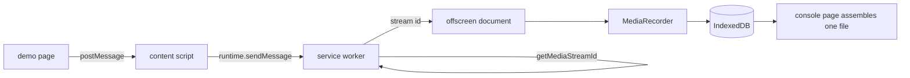

# Capture feasibility spike: the extension works, the gesture is real, and force-install needs an enrolled Mac (2026-09-09 23:43)

Page: https://claude.ai/code/artifact/c9d29648-ee7e-4662-abe3-80c48762b6c3
Plan: [docs/plans/2026-09-09-capture-feasibility-spike.md](../plans/2026-09-09-capture-feasibility-spike.md)

## Summary

The extension shape in the sketch works end to end: a web page asks, the service worker gets a stream id, an offscreen document records the composited tab at 1920 by 1080 and 15 frames a second in VP9, every timeslice lands in IndexedDB, and the chunks concatenate into a file ffprobe and Chrome both read.
The gesture requirement in the Chrome documentation is real and comes from one line in Chromium: capture is granted to a tab the user has invoked the extension on, or to an extension whose id Chrome was launched with as `--allowlisted-extension-id`.
Nothing else lifts it: not force-install, not `<all_urls>`, not a policy.
With the launch flag, start and stop ran with no click at all, across three cycles, a page reload, a killed offscreen document and an audio capture.
The flag has to be on Chrome's command line, so it needs a launcher and cannot come from policy; without it the fleet gets one click per tab, which was accepted before the spike.
On this Mac, Chrome refused to force-install the packed extension with the sentence "This computer is not detected as enterprise managed so policy can only automatically install extensions hosted on the Chrome Webstore", so an off-store deployment needs MDM enrolment and the Web Store is the other path.
The recommendation is to continue with the extension, and to put two decisions to the client: whether their machines launch Chrome through something that can pass a flag, and whether the extension goes through the Web Store or their MDM.

## What was built

Everything the plan listed, on the branch `spike/capture-feasibility`, in TypeScript with Vite and Playwright.

| Piece | Where | What it does |
| ----- | ----- | ------------ |
| Protocol | `src/shared/protocol.ts` | The messages between page, content script, service worker and offscreen document, types only |
| Content script | `src/extension/content-script.ts` | Relays a request from the page's window to the service worker and posts the reply back |
| Service worker | `src/extension/service-worker.ts` | Checks the origin and the tab, asks Chrome for a stream id, keeps one offscreen document, records what each tab is recording in session storage |
| Offscreen document | `src/extension/offscreen.ts` | Opens the stream, runs MediaRecorder with a timeslice, writes every chunk to IndexedDB, replays captured audio through an AudioContext |
| Spool | `src/extension/db.ts` | IndexedDB schema version 1: a `recordings` store and a `chunks` store keyed by recording and sequence |
| Console page | `src/extension/console.html` | Lists the spool, assembles a recording into one file, kills the offscreen document to simulate a crash |
| Demo application | `src/demo/` | A landing page, then a page with a drawing canvas, an autoplaying YouTube embed and a Done button |
| Test | `tests/spike.spec.ts` | Drives all of the above in Playwright's Chromium and prints every finding with a `FINDING:` prefix |
| Spike scripts | `scripts/spike/` | Pack a `.crx`, write and remove the Chrome policies, serve the demo and the package, probe a real Chrome over the DevTools protocol |

Vite handled the four extension entries without a plugin: the service worker, the content script and two pages come out under their own names, and `build.sh` fails the build if the content script ever gains an import.
esbuild was not needed.



## Q1: the gesture is a per-tab grant, and the only substitute is a launch flag

**Without invocation, Chrome refuses with the documented sentence.**
On a fresh tab in Playwright's Chromium 153.0.8010.12 the probe and the real request both returned:

```text
Extension has not been invoked for the current page (see activeTab permission). Chrome pages cannot be captured.
```

The demo's `START_RECORDING` came back as `RECORDING_ERROR` with code `CAPTURE_FAILED` and that text as its detail.

**Host permissions do not help.**
Adding `"host_permissions": ["<all_urls>"]` to the manifest and re-running produced the identical refusal.

**The rule is one condition in Chromium.**
`chrome/browser/extensions/api/tab_capture/tab_capture_api.cc` on `main` reads:

```cpp
if (!extension()->permissions_data()->HasAPIPermissionForTab(
    sessions::SessionTabHelper::IdForTab(target_contents).id(),
    mojom::APIPermissionID::kTabCaptureForTab) &&
    (GetAllowlistedExtensionID() != extension_id)) {
  return RespondNow(Error(kGrantError));
}
```

where `GetAllowlistedExtensionID()` returns the value of the `--allowlisted-extension-id` command-line switch.
There is no kiosk exception and no host-permission check.

**Three automated gestures were tried, and the machine blocked two of them.**

| Method | What happened | Probe afterwards |
| ------ | ------------- | ---------------- |
| Playwright keyboard, `Meta+Shift+KeyY` on the `commands` shortcut | Reached the renderer only | refused |
| System Events keystroke through `osascript` | `osascript is not allowed to send keystrokes. (1002)` | refused |
| System Events click on the toolbar button | `osascript is not allowed assistive access. (-1719)` | refused |

The second and third failed in macOS before they reached Chrome: the terminal running the session, iTerm2, has no Accessibility permission.
Granting it in System Settings, Privacy and Security, Accessibility, and re-running with `NIMBUS_ALLOWLIST=0 ./build.sh test` is what tests whether a real keystroke or a toolbar click counts as an invocation.
That remains unmeasured.

**With `--allowlisted-extension-id`, everything downstream ran with no click.**
The probe on a fresh tab was granted, and three start and stop cycles followed.

| Cycle | Reply to start | Chunks | Bytes |
| ----- | -------------- | ------ | ----- |
| 1 | `RECORDING_STARTED`, `video/webm;codecs=vp9,opus`, 1920 by 1080 at 15 fps | 4 | 1,350,262 |
| 2 | same | 2 | 1,297,213 |
| 3 | same | 2 | 1,449,794 |

Each cycle recorded for six seconds with a two second timeslice.
The chunk count varies because MediaRecorder treats the timeslice as a minimum and cuts at its own boundaries; the byte counts say the data is all there.
About 1.3 to 1.45 MB for six seconds is 1.7 to 1.9 megabits a second against the 3 megabits asked for, which is the encoder undershooting on a page that is still apart from the canvas and the video.

**The recording survives a reload of the page, and the page finds it again.**
With a recording live, the page was reloaded.
Its `START_RECORDING` on load came back as `ALREADY_RECORDING` naming the live recording, which is the intended answer, since the recording key is kept in session storage.
Done from the reloaded page stopped that recording with `RECORDING_STOPPED`.
While the stream was live the probe answered "Cannot capture a tab with an active stream.", which is a different refusal from the grant and a reason the probe must be run between recordings.
The probe after the stop was granted, under the flag; whether a click-granted `activeTab` survives a reload is not answered by this run.

## Q2: the file plays, and a killed recorder loses less than a timeslice

**The concatenation is a WebM that ffprobe parses in full.**
The console page assembled each recording from its chunks in sequence order, and the test read the file back:

```text
ffprobe -v error -count_packets -show_entries format=format_name:stream=codec_type,codec_name,nb_read_packets -of json FILE
ffprobe -v error -select_streams v:0 -show_entries packet=pts_time -of csv=p=0 FILE
```

| File | Format | Streams | Packets | Last video packet |
| ---- | ------ | ------- | ------- | ----------------- |
| cycle-1.webm | matroska,webm | vp9 | 95 | 6.31 s |
| killed.webm | matroska,webm | vp9 | 77 | 4.95 s |
| audio.webm | matroska,webm | vp9, opus | 203 | 6.17 s |

ffprobe reports no duration for any of them, because a MediaRecorder stream writes no duration or cues into its header.
The plan's "sane duration" therefore had to be measured by decoding, and it was.
Chrome plays all three.
The backend that remuxes them gets a seekable file for free.

**The footage is the tab, checked by eye.**
A frame three seconds into `cycle-1.webm`, pulled with `ffmpeg -ss 3 -frames:v 1`, shows the demo page as the viewer saw it: the heading, the extension's `RECORDING_STARTED` reply, the canvas with its clock and moving ball, and the YouTube player beneath.
The page carries that frame.
Tab capture records the viewport, so the test's window is 1440 by 1100 to keep the player in the footage; the first run used Playwright's default of 1280 by 720 and cut the player off below the fold.
The three files and the frame are committed beside this report in [2026-09-09-2343-capture-feasibility-spike/](2026-09-09-2343-capture-feasibility-spike/): [cycle-1.webm](2026-09-09-2343-capture-feasibility-spike/cycle-1.webm), [killed.webm](2026-09-09-2343-capture-feasibility-spike/killed.webm), [audio.webm](2026-09-09-2343-capture-feasibility-spike/audio.webm) and [cycle-1-3s.jpg](2026-09-09-2343-capture-feasibility-spike/cycle-1-3s.jpg).
Chrome plays them and QuickTime does not.

**Killing the offscreen document mid-recording kept 4.95 of about 6 seconds.**
The console page's "Close the offscreen document" was pressed after six seconds of recording.
The page's Done then returned `RECORDING_ERROR` with code `OFFSCREEN_GONE`, and the spool held the committed chunks, which concatenated into a file with 77 video packets ending at 4.95 seconds.
The loss is what was in the encoder since the last timeslice boundary, under two seconds here and under five with the default timeslice.

## Q3: tab audio records as an Opus track

With the demo's audio box ticked, `RECORDING_STARTED` reported `audio: true` and the file carried a second stream, `audio:opus`, with 203 packets against the video-only file's 95.
The offscreen document routes the captured track through an `AudioContext` so the tab keeps playing, which is the documented way to do it.
Whether the tab actually went silent without that, and whether the replay is audible, needs ears and was not measured.

## Q4: user-level policy is read as a recommendation, and off-store force-install needs an enrolled Mac

**Packing works.**
`scripts/spike/pack.sh` had Google Chrome 150 pack `dist/extension` with the key in `.signing/`, with `--no-message-box` suppressing the dialog.
The result is a 24,473 byte CRX3 file (magic `Cr24`, version 3) with the id `oibiheibjolbkmifdocjhkfalginaofm`, the same id the manifest's `key` gives the unpacked build, and an update manifest pointing at `http://localhost:8765/nimbus-tab-dvr.crx`.

**Chrome read the user-level keys and did not act on them.**
`scripts/spike/policy.sh install` wrote `ExtensionInstallForcelist` into `com.google.Chrome` and `allowedOrigins` into `com.google.Chrome.extensions.<id>` with `defaults write`.
A fresh-profile Chrome 150.0.7871.101 launched by `scripts/spike/managed-probe.mjs` showed on chrome://policy:

| Policy | Value | Source | Applies to | Level | Status |
| ------ | ----- | ------ | ---------- | ----- | ------ |
| ExtensionInstallForcelist | `["[BLOCKED]oibiheibjolbkmifdocjhkfalginaofm;http://localhost:8765/updates.xml"]` | Platform | Current user | Recommended | Error, Warning |

Unfolded, the row said:

```text
Error at ExtensionInstallForcelist[0]: Invalid extension ID.
This computer is not detected as enterprise managed so policy can only automatically install extensions hosted on the Chrome Webstore. The Chrome Webstore update URL is "https://clients2.google.com/service/update2/crx".
```

Two facts are in that row.
A user-level `defaults write` arrives as a Recommended policy rather than a Mandatory one, so it could not force anything even if it were allowed.
And an id that is not on the Web Store is blocked unless the machine is enterprise managed, which on macOS means MDM enrolment.
The demo page saw no extension, the managed configuration was never read, and whether Chrome accepts a plain-HTTP update URL was never reached.

**The real Chrome ignores `--load-extension`.**
Launching Chrome 150 with the flag and the allowlist flag together installed nothing: chrome://extensions listed only Google Docs Offline.
So on the fleet's actual browser an extension arrives from the Web Store, from a managed force-install, or by hand through developer mode.
The end-to-end run with the allowlist flag is therefore verified on Chromium 153 and unverified on Chrome 150.
`KEEP_PROFILE=1` lets the probe reuse a profile in which the extension was loaded unpacked by hand, which is how that gap closes.

## Deviations from the plan

- **The bundler question closed on the first build**: Vite emitted all four entries cleanly, so esbuild was never tried.
- **`fmt` is still declared and does nothing.** The plan said Vite brings a formatter; it does not, and Prettier is outside the budget until asked for.
- **Two type-only packages joined the budget**, `@types/chrome` and `@types/node`, because `tsc --noEmit` cannot check the extension or the test without them.
- **The allowlist flag is the test's default**, with `NIMBUS_ALLOWLIST=0` running the gesture ladder instead, because the ladder is blocked on this machine and CI has no display.
- **A fourth script, `scripts/spike/managed-probe.mjs`, was added** to read a real Chrome's policy page and extension state over the DevTools protocol, because those pages hide their content in shadow roots and ignore synthetic input.
- **`--disable-extensions-except` and `--load-extension` only work in Chromium builds**, which is why the test runs in Playwright's Chromium and the managed probe in Chrome.

## Verified and unverified

**Verified by running:**

- The full request path, from page to file, on Chromium 153.0.8010.12 with the extension unpacked.
- The refusal text without invocation, with and without `<all_urls>`.
- The allowlist flag granting capture with no gesture, on Chromium 153.
- The behaviour across reload, a killed offscreen document, and audio capture.
- Packing a CRX3 with Chrome 150 and the id it carries.
- What Chrome 150 does with user-level policy keys, verbatim.

**Read, not run:**

- The Chromium source of the grant check, fetched from `chromium.googlesource.com` at `main` on 2026-09-09.

**Not measured:**

- Whether a real click or keystroke counts as an invocation from automation, blocked by iTerm2's missing Accessibility permission.
- Whether a click-granted `activeTab` survives a reload of the page.
- The allowlist flag on Chrome 150 itself.
- The managed configuration reaching `chrome.storage.managed`, and a plain-HTTP update URL, both behind the force-install block.
- Whether the captured tab goes silent, and whether the AudioContext replay restores it.
- Anything longer than six seconds.

## Provenance

- Branch `spike/capture-feasibility`, on top of `44bc84f` (the plan).
- Google Chrome 150.0.7871.101 at `/Applications/Google Chrome.app`; Playwright 1.63.0 with Chromium 153.0.8010.12; Node 26.6.0; npm 11.18.0; TypeScript 7.0.2; Vite 8.2.2; ffprobe 8.1.1; macOS Darwin 25.6.0.
- The test run: `./build.sh && ./build.sh test`, two tests passed in 54 seconds; its findings are the `FINDING:` lines in the output, and the numbers above are from the final run with the 1440 by 1100 window.
- The managed probe: `scripts/spike/policy.sh install`, `node scripts/spike/serve.mjs`, `node scripts/spike/managed-probe.mjs`, then `scripts/spike/policy.sh remove`.
- The three recordings and the frame are committed beside this report; the policy screenshots and probe logs stay under `test-results/spike/`, which is not.

## What this decides

- **GRILLING 2a is answered yes with a condition.** The interface gives what the design needs, after one invocation per tab or with the launch flag.
- **GRILLING 2b gains a third option** beside DevTools screencast and native capture: launch Chrome with `--allowlisted-extension-id`.
- **GRILLING 5a narrows** to the Web Store or an MDM-enrolled fleet, and 5b names the packing key.
- **The next plan is phase 2 of the sketch**, the application contract, and it inherits this code.
